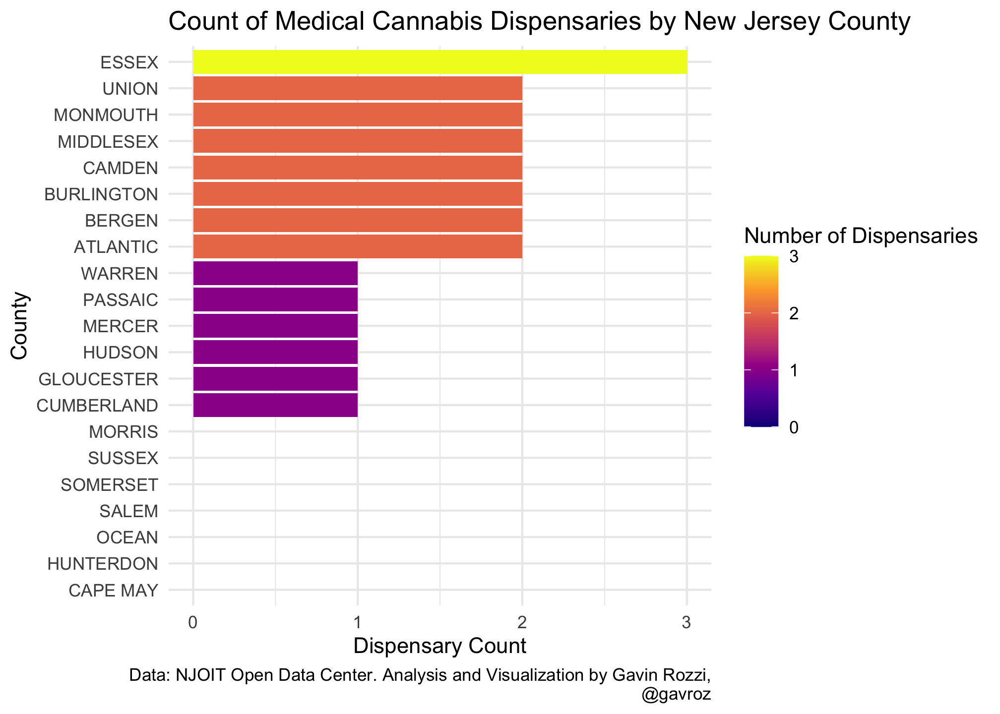

## One third of NJ counties lack even a single dispensary

Between a lack of permits available from the state Department of Health
(now handled by the Cannabis Regulatory Commission), a [patchwork of
local zoning and planning
decisions](https://www.app.com/story/news/local/new-jersey/marijuana/2022/04/14/nj-weed-legalization-toms-river-consider-medical-pot-businesses/7289527001/)
that often serve as obstacle, and [litigation over the previous
round](https://www.njcourts.gov/attorneys/assets/opinions/appellate/published/a2204-18a2219-18a2276-18a2278-18a2283-18a2288-18a2292-18a2305-18.pdf?c=fHo)
of dispensary permits, efforts to expand dispensaries have moved slowly.

The end result has been an unequal allocation of dispensaries across New
Jersey — with some counties missing out entirely. That has left
residents to look to neighboring counties to obtain medical cannabis.

A third of all counties — Morris, Sussex, Somerset, Salem, Ocean,
Hunterdon & Cape May — have not had a single medical cannabis dispensary
commence operations since the state’s medical cannabis began under
Governor Chris Christie, [according to official state
records.](https://data.nj.gov/Reference-Data/New-Jersey-Cannabis-Dispensary-List/p3ry-ipie)

## Mapping the towns left behind by existing dispensaries

For those who reside in a county without a dispensary, travel times can
be quite onerous. I’m particularly interested in looking at regions of
New Jersey that are more than half an hour’s drive to the nearest
dispensary to illuminate regions of the state that might be best served
by new dispensaries.

Using a tool called [Open Source Routing Machine
(OSRM)](http://project-osrm.org) via R, I created isochrones — polygons
that show drive times to a location at various geographic distances —
for all currently licensed cannabis dispensaries in New Jersey. Inner
segments of each polygon have shorter drive times, while outer segments
represent a max drive time of half an hour (30 minutes). Those who
reside in towns outside of this polygon can face max drive times of 30
minutes to over an hour to reach the nearest dispensary.

### Over 756,000 New Jerseyans face long drives to the nearest dispensary

The left side of the map shows a combined region of the state that can
reach the nearest dispensary within 30 minutes, while the right side
shows the individual isochrones, colored at 10 minute intervals.
Individual dispensaries are mapped as pink points.

Municipalities are mapped and colored by population, and were included
in this map if 100% of their boundaries placed them at a maximum
drive time of 30 minutes or greater to reach the nearest dispensary.

110 municipalities which are home to 756,034 New Jerseyans face maximum
drive times of 30 minutes or greater to the nearest dispensary, a
problem that is compounded by a lack of public transit infrastructure in
some regions of the state.

<iframe seamless
src="kepler.gl-4.html" width="100%" height="800">
</iframe>

## Concluding thoughts

Many medical cannabis patients are rightfully concerned that adult-use
recreational sales will place further strain on an already inadequate
system, with just 23 dispensaries serving a state of over 9 million
residents. [Just 13 of
them](https://www.app.com/story/news/local/new-jersey/marijuana/2022/04/11/nj-marijuana-legalization-medical-dispensaries-sales-approved/9533448002/)
are set to start offering recreational sales when they begin on April
21st.

Much of Ocean County in the state’s coastal region, and the northwest
portion of the state in Sussex, Warren, Hunterdon & Morris counties are
located outside of a reasonable distance to the nearest medical cannabis
dispensary. Portions of Salem and Cape May counties would also benefit
from a more optimally placed dispensary to better serve these
municipalities.

New Jersey’s cannabis regulators should adopt a data-driven planning
strategy to strategically target under-served regions of the state to
ensure a more equitable allocation of future dispensaries to the regions
of New Jersey currently lacking them.

## The full list of towns

All 110 municipalities highlighted in this post with their current
population from the 2020 ACS can be found below.

<table>
<thead>
<tr class="header">
<th style="text-align: left;">Town</th>
<th style="text-align: right;">Population Estimate</th>
</tr>
</thead>
<tbody>
<tr class="odd">
<td style="text-align: left;">Hope township, Warren County, New Jersey</td>
<td style="text-align: right;">1897</td>
</tr>
<tr class="even">
<td style="text-align: left;">Woodbine borough, Cape May County, New Jersey</td>
<td style="text-align: right;">2352</td>
</tr>
<tr class="odd">
<td style="text-align: left;">Wildwood Crest borough, Cape May County, New Jersey</td>
<td style="text-align: right;">3073</td>
</tr>
<tr class="even">
<td style="text-align: left;">Glen Gardner borough, Hunterdon County, New Jersey</td>
<td style="text-align: right;">1554</td>
</tr>
<tr class="odd">
<td style="text-align: left;">West Cape May borough, Cape May County, New Jersey</td>
<td style="text-align: right;">1008</td>
</tr>
<tr class="even">
<td style="text-align: left;">Pine Beach borough, Ocean County, New Jersey</td>
<td style="text-align: right;">2361</td>
</tr>
<tr class="odd">
<td style="text-align: left;">Flemington borough, Hunterdon County, New Jersey</td>
<td style="text-align: right;">4601</td>
</tr>
<tr class="even">
<td style="text-align: left;">West Wildwood borough, Cape May County, New Jersey</td>
<td style="text-align: right;">409</td>
</tr>
<tr class="odd">
<td style="text-align: left;">Wharton borough, Morris County, New Jersey</td>
<td style="text-align: right;">6458</td>
</tr>
<tr class="even">
<td style="text-align: left;">Eagleswood township, Ocean County, New Jersey</td>
<td style="text-align: right;">1558</td>
</tr>
<tr class="odd">
<td style="text-align: left;">Lavallette borough, Ocean County, New Jersey</td>
<td style="text-align: right;">2171</td>
</tr>
<tr class="even">
<td style="text-align: left;">Ship Bottom borough, Ocean County, New Jersey</td>
<td style="text-align: right;">1074</td>
</tr>
<tr class="odd">
<td style="text-align: left;">Green township, Sussex County, New Jersey</td>
<td style="text-align: right;">3482</td>
</tr>
<tr class="even">
<td style="text-align: left;">Newton town, Sussex County, New Jersey</td>
<td style="text-align: right;">7935</td>
</tr>
<tr class="odd">
<td style="text-align: left;">Beach Haven borough, Ocean County, New Jersey</td>
<td style="text-align: right;">979</td>
</tr>
<tr class="even">
<td style="text-align: left;">Lambertville city, Hunterdon County, New Jersey</td>
<td style="text-align: right;">3809</td>
</tr>
<tr class="odd">
<td style="text-align: left;">Lafayette township, Sussex County, New Jersey</td>
<td style="text-align: right;">2238</td>
</tr>
<tr class="even">
<td style="text-align: left;">Ocean Gate borough, Ocean County, New Jersey</td>
<td style="text-align: right;">1488</td>
</tr>
<tr class="odd">
<td style="text-align: left;">Surf City borough, Ocean County, New Jersey</td>
<td style="text-align: right;">1260</td>
</tr>
<tr class="even">
<td style="text-align: left;">Stone Harbor borough, Cape May County, New Jersey</td>
<td style="text-align: right;">876</td>
</tr>
<tr class="odd">
<td style="text-align: left;">Andover borough, Sussex County, New Jersey</td>
<td style="text-align: right;">675</td>
</tr>
<tr class="even">
<td style="text-align: left;">Frenchtown borough, Hunterdon County, New Jersey</td>
<td style="text-align: right;">1366</td>
</tr>
<tr class="odd">
<td style="text-align: left;">Millstone borough, Somerset County, New Jersey</td>
<td style="text-align: right;">573</td>
</tr>
<tr class="even">
<td style="text-align: left;">Island Heights borough, Ocean County, New Jersey</td>
<td style="text-align: right;">1480</td>
</tr>
<tr class="odd">
<td style="text-align: left;">Clinton town, Hunterdon County, New Jersey</td>
<td style="text-align: right;">2699</td>
</tr>
<tr class="even">
<td style="text-align: left;">Lakehurst borough, Ocean County, New Jersey</td>
<td style="text-align: right;">2707</td>
</tr>
<tr class="odd">
<td style="text-align: left;">Sussex borough, Sussex County, New Jersey</td>
<td style="text-align: right;">1836</td>
</tr>
<tr class="even">
<td style="text-align: left;">Harvey Cedars borough, Ocean County, New Jersey</td>
<td style="text-align: right;">452</td>
</tr>
<tr class="odd">
<td style="text-align: left;">Salem city, Salem County, New Jersey</td>
<td style="text-align: right;">4761</td>
</tr>
<tr class="even">
<td style="text-align: left;">Barnegat Light borough, Ocean County, New Jersey</td>
<td style="text-align: right;">461</td>
</tr>
<tr class="odd">
<td style="text-align: left;">Woodland township, Burlington County, New Jersey</td>
<td style="text-align: right;">1951</td>
</tr>
<tr class="even">
<td style="text-align: left;">Mount Arlington borough, Morris County, New Jersey</td>
<td style="text-align: right;">5751</td>
</tr>
<tr class="odd">
<td style="text-align: left;">Branchburg township, Somerset County, New Jersey</td>
<td style="text-align: right;">14509</td>
</tr>
<tr class="even">
<td style="text-align: left;">Barnegat township, Ocean County, New Jersey</td>
<td style="text-align: right;">23155</td>
</tr>
<tr class="odd">
<td style="text-align: left;">Avalon borough, Cape May County, New Jersey</td>
<td style="text-align: right;">1456</td>
</tr>
<tr class="even">
<td style="text-align: left;">Somerville borough, Somerset County, New Jersey</td>
<td style="text-align: right;">12139</td>
</tr>
<tr class="odd">
<td style="text-align: left;">Carneys Point township, Salem County, New Jersey</td>
<td style="text-align: right;">7722</td>
</tr>
<tr class="even">
<td style="text-align: left;">Frelinghuysen township, Warren County, New Jersey</td>
<td style="text-align: right;">2085</td>
</tr>
<tr class="odd">
<td style="text-align: left;">Knowlton township, Warren County, New Jersey</td>
<td style="text-align: right;">2941</td>
</tr>
<tr class="even">
<td style="text-align: left;">Delaware township, Hunterdon County, New Jersey</td>
<td style="text-align: right;">4443</td>
</tr>
<tr class="odd">
<td style="text-align: left;">High Bridge borough, Hunterdon County, New Jersey</td>
<td style="text-align: right;">3460</td>
</tr>
<tr class="even">
<td style="text-align: left;">Kingwood township, Hunterdon County, New Jersey</td>
<td style="text-align: right;">3749</td>
</tr>
<tr class="odd">
<td style="text-align: left;">Lebanon township, Hunterdon County, New Jersey</td>
<td style="text-align: right;">6106</td>
</tr>
<tr class="even">
<td style="text-align: left;">Readington township, Hunterdon County, New Jersey</td>
<td style="text-align: right;">15889</td>
</tr>
<tr class="odd">
<td style="text-align: left;">Tewksbury township, Hunterdon County, New Jersey</td>
<td style="text-align: right;">5796</td>
</tr>
<tr class="even">
<td style="text-align: left;">Raritan borough, Somerset County, New Jersey</td>
<td style="text-align: right;">7833</td>
</tr>
<tr class="odd">
<td style="text-align: left;">Cape May city, Cape May County, New Jersey</td>
<td style="text-align: right;">3446</td>
</tr>
<tr class="even">
<td style="text-align: left;">Middle township, Cape May County, New Jersey</td>
<td style="text-align: right;">18400</td>
</tr>
<tr class="odd">
<td style="text-align: left;">Chester township, Morris County, New Jersey</td>
<td style="text-align: right;">7734</td>
</tr>
<tr class="even">
<td style="text-align: left;">Jefferson township, Morris County, New Jersey</td>
<td style="text-align: right;">20912</td>
</tr>
<tr class="odd">
<td style="text-align: left;">Allamuchy township, Warren County, New Jersey</td>
<td style="text-align: right;">4640</td>
</tr>
<tr class="even">
<td style="text-align: left;">Liberty township, Warren County, New Jersey</td>
<td style="text-align: right;">2826</td>
</tr>
<tr class="odd">
<td style="text-align: left;">Mendham borough, Morris County, New Jersey</td>
<td style="text-align: right;">4880</td>
</tr>
<tr class="even">
<td style="text-align: left;">Mine Hill township, Morris County, New Jersey</td>
<td style="text-align: right;">3511</td>
</tr>
<tr class="odd">
<td style="text-align: left;">Netcong borough, Morris County, New Jersey</td>
<td style="text-align: right;">3167</td>
</tr>
<tr class="even">
<td style="text-align: left;">Roxbury township, Morris County, New Jersey</td>
<td style="text-align: right;">22882</td>
</tr>
<tr class="odd">
<td style="text-align: left;">Berkeley township, Ocean County, New Jersey</td>
<td style="text-align: right;">41963</td>
</tr>
<tr class="even">
<td style="text-align: left;">Lacey township, Ocean County, New Jersey</td>
<td style="text-align: right;">29076</td>
</tr>
<tr class="odd">
<td style="text-align: left;">Tuckerton borough, Ocean County, New Jersey</td>
<td style="text-align: right;">3373</td>
</tr>
<tr class="even">
<td style="text-align: left;">Stillwater township, Sussex County, New Jersey</td>
<td style="text-align: right;">3900</td>
</tr>
<tr class="odd">
<td style="text-align: left;">Independence township, Warren County, New Jersey</td>
<td style="text-align: right;">5438</td>
</tr>
<tr class="even">
<td style="text-align: left;">Lebanon borough, Hunterdon County, New Jersey</td>
<td style="text-align: right;">2040</td>
</tr>
<tr class="odd">
<td style="text-align: left;">Branchville borough, Sussex County, New Jersey</td>
<td style="text-align: right;">1054</td>
</tr>
<tr class="even">
<td style="text-align: left;">Hamburg borough, Sussex County, New Jersey</td>
<td style="text-align: right;">3149</td>
</tr>
<tr class="odd">
<td style="text-align: left;">Hardyston township, Sussex County, New Jersey</td>
<td style="text-align: right;">7815</td>
</tr>
<tr class="even">
<td style="text-align: left;">Montague township, Sussex County, New Jersey</td>
<td style="text-align: right;">3666</td>
</tr>
<tr class="odd">
<td style="text-align: left;">Ogdensburg borough, Sussex County, New Jersey</td>
<td style="text-align: right;">2164</td>
</tr>
<tr class="even">
<td style="text-align: left;">Sparta township, Sussex County, New Jersey</td>
<td style="text-align: right;">18681</td>
</tr>
<tr class="odd">
<td style="text-align: left;">Hardwick township, Warren County, New Jersey</td>
<td style="text-align: right;">1519</td>
</tr>
<tr class="even">
<td style="text-align: left;">Stanhope borough, Sussex County, New Jersey</td>
<td style="text-align: right;">3327</td>
</tr>
<tr class="odd">
<td style="text-align: left;">Vernon township, Sussex County, New Jersey</td>
<td style="text-align: right;">22102</td>
</tr>
<tr class="even">
<td style="text-align: left;">Wantage township, Sussex County, New Jersey</td>
<td style="text-align: right;">10899</td>
</tr>
<tr class="odd">
<td style="text-align: left;">Byram township, Sussex County, New Jersey</td>
<td style="text-align: right;">7944</td>
</tr>
<tr class="even">
<td style="text-align: left;">Seaside Park borough, Ocean County, New Jersey</td>
<td style="text-align: right;">1752</td>
</tr>
<tr class="odd">
<td style="text-align: left;">Sea Isle City city, Cape May County, New Jersey</td>
<td style="text-align: right;">2122</td>
</tr>
<tr class="even">
<td style="text-align: left;">Washington township, Morris County, New Jersey</td>
<td style="text-align: right;">18304</td>
</tr>
<tr class="odd">
<td style="text-align: left;">Clinton township, Hunterdon County, New Jersey</td>
<td style="text-align: right;">12909</td>
</tr>
<tr class="even">
<td style="text-align: left;">Cape May Point borough, Cape May County, New Jersey</td>
<td style="text-align: right;">165</td>
</tr>
<tr class="odd">
<td style="text-align: left;">Pennsville township, Salem County, New Jersey</td>
<td style="text-align: right;">12505</td>
</tr>
<tr class="even">
<td style="text-align: left;">Stafford township, Ocean County, New Jersey</td>
<td style="text-align: right;">27674</td>
</tr>
<tr class="odd">
<td style="text-align: left;">Mannington township, Salem County, New Jersey</td>
<td style="text-align: right;">1854</td>
</tr>
<tr class="even">
<td style="text-align: left;">Lower township, Cape May County, New Jersey</td>
<td style="text-align: right;">21515</td>
</tr>
<tr class="odd">
<td style="text-align: left;">Manchester township, Ocean County, New Jersey</td>
<td style="text-align: right;">43649</td>
</tr>
<tr class="even">
<td style="text-align: left;">Seaside Heights borough, Ocean County, New Jersey</td>
<td style="text-align: right;">2917</td>
</tr>
<tr class="odd">
<td style="text-align: left;">Andover township, Sussex County, New Jersey</td>
<td style="text-align: right;">5914</td>
</tr>
<tr class="even">
<td style="text-align: left;">Franklin borough, Sussex County, New Jersey</td>
<td style="text-align: right;">4737</td>
</tr>
<tr class="odd">
<td style="text-align: left;">Hopatcong borough, Sussex County, New Jersey</td>
<td style="text-align: right;">14228</td>
</tr>
<tr class="even">
<td style="text-align: left;">Sandyston township, Sussex County, New Jersey</td>
<td style="text-align: right;">1893</td>
</tr>
<tr class="odd">
<td style="text-align: left;">Peapack and Gladstone borough, Somerset County, New Jersey</td>
<td style="text-align: right;">2582</td>
</tr>
<tr class="even">
<td style="text-align: left;">Chester borough, Morris County, New Jersey</td>
<td style="text-align: right;">1514</td>
</tr>
<tr class="odd">
<td style="text-align: left;">Wildwood city, Cape May County, New Jersey</td>
<td style="text-align: right;">4985</td>
</tr>
<tr class="even">
<td style="text-align: left;">Penns Grove borough, Salem County, New Jersey</td>
<td style="text-align: right;">4793</td>
</tr>
<tr class="odd">
<td style="text-align: left;">Califon borough, Hunterdon County, New Jersey</td>
<td style="text-align: right;">1184</td>
</tr>
<tr class="even">
<td style="text-align: left;">Stockton borough, Hunterdon County, New Jersey</td>
<td style="text-align: right;">472</td>
</tr>
<tr class="odd">
<td style="text-align: left;">Elsinboro township, Salem County, New Jersey</td>
<td style="text-align: right;">931</td>
</tr>
<tr class="even">
<td style="text-align: left;">North Wildwood city, Cape May County, New Jersey</td>
<td style="text-align: right;">3794</td>
</tr>
<tr class="odd">
<td style="text-align: left;">Raritan township, Hunterdon County, New Jersey</td>
<td style="text-align: right;">22252</td>
</tr>
<tr class="even">
<td style="text-align: left;">Hackettstown town, Warren County, New Jersey</td>
<td style="text-align: right;">9440</td>
</tr>
<tr class="odd">
<td style="text-align: left;">South Toms River borough, Ocean County, New Jersey</td>
<td style="text-align: right;">3676</td>
</tr>
<tr class="even">
<td style="text-align: left;">Fredon township, Sussex County, New Jersey</td>
<td style="text-align: right;">3172</td>
</tr>
<tr class="odd">
<td style="text-align: left;">Walpack township, Sussex County, New Jersey</td>
<td style="text-align: right;">8</td>
</tr>
<tr class="even">
<td style="text-align: left;">Long Beach township, Ocean County, New Jersey</td>
<td style="text-align: right;">3074</td>
</tr>
<tr class="odd">
<td style="text-align: left;">Frankford township, Sussex County, New Jersey</td>
<td style="text-align: right;">5312</td>
</tr>
<tr class="even">
<td style="text-align: left;">Beachwood borough, Ocean County, New Jersey</td>
<td style="text-align: right;">11274</td>
</tr>
<tr class="odd">
<td style="text-align: left;">Ocean township, Ocean County, New Jersey</td>
<td style="text-align: right;">9071</td>
</tr>
<tr class="even">
<td style="text-align: left;">Lower Alloways Creek township, Salem County, New Jersey</td>
<td style="text-align: right;">1729</td>
</tr>
<tr class="odd">
<td style="text-align: left;">Blairstown township, Warren County, New Jersey</td>
<td style="text-align: right;">5727</td>
</tr>
<tr class="even">
<td style="text-align: left;">Mount Olive township, Morris County, New Jersey</td>
<td style="text-align: right;">28913</td>
</tr>
<tr class="odd">
<td style="text-align: left;">Hampton township, Sussex County, New Jersey</td>
<td style="text-align: right;">4865</td>
</tr>
<tr class="even">
<td style="text-align: left;">Bedminster township, Somerset County, New Jersey</td>
<td style="text-align: right;">8042</td>
</tr>
</tbody>
</table>
